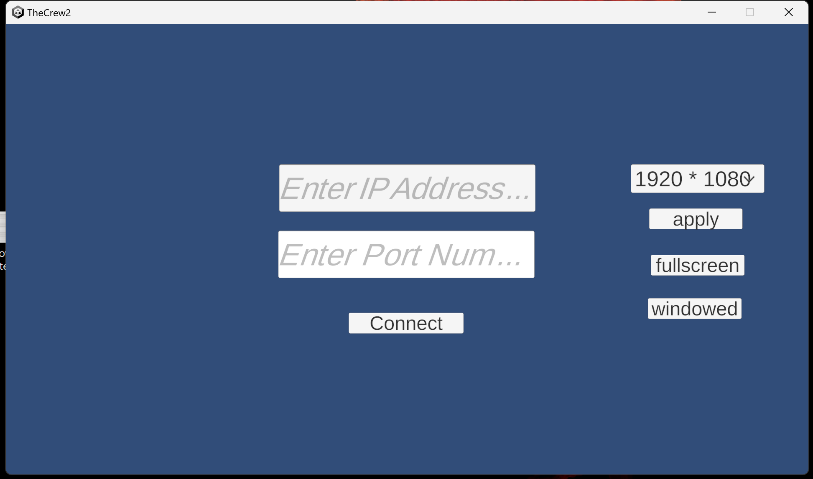
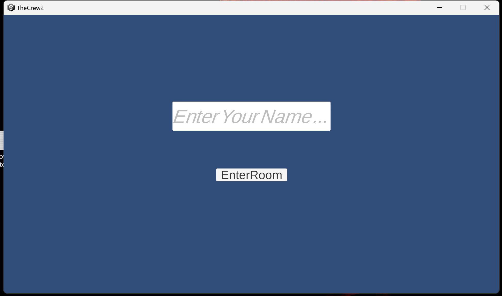
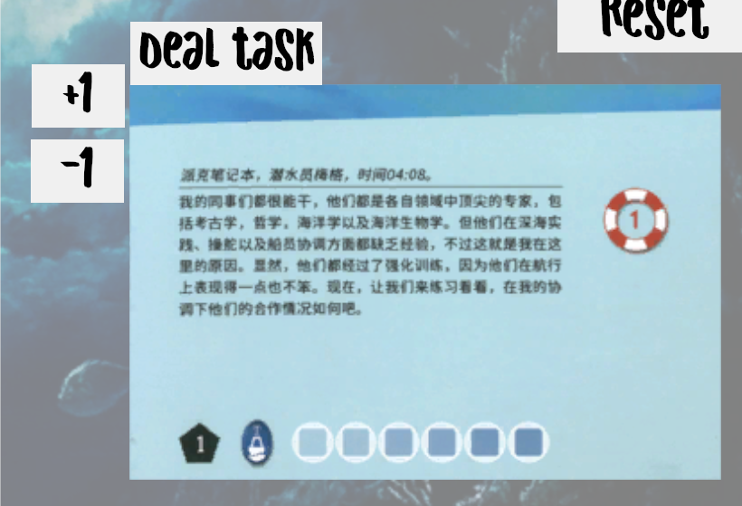
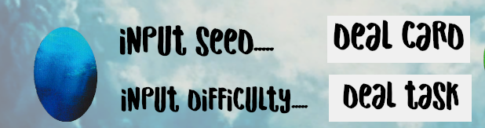
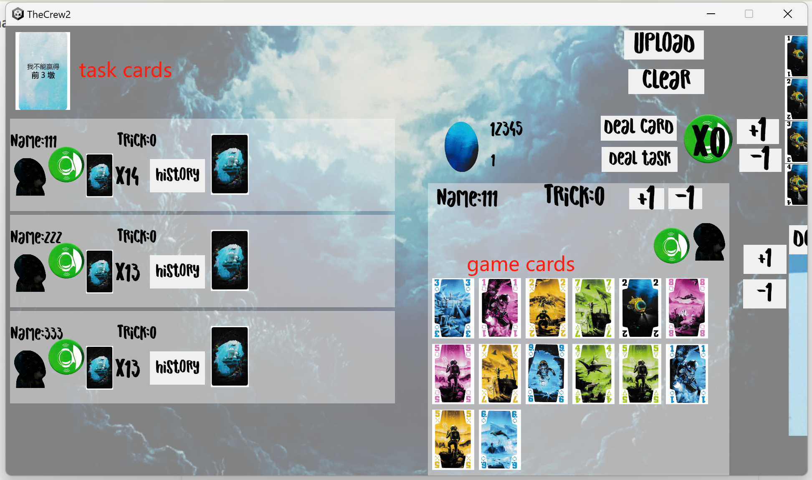
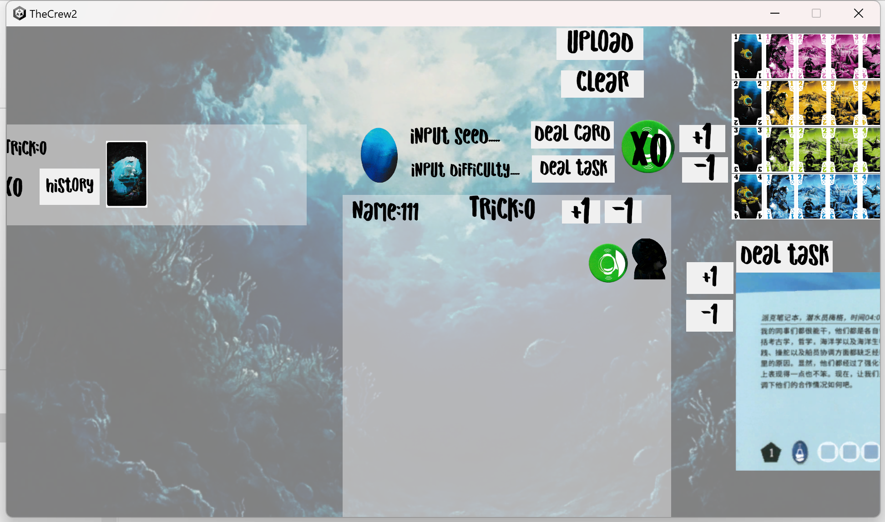

# TheCrew

# Usage Restrictions
This project is for personal and educational purposes only. Commercial use is strictly prohibited.
All copyrighted content used in this project (such as images, music, characters, etc.) belongs to their respective copyright holders. Unauthorized use of such content may infringe on copyright laws.
Please comply with applicable copyright laws and use the content responsibly.
This project is provided "as-is," without any warranties. The author is not liable for any issues or legal disputes that may arise from the use of this project.

# Disclaimer
This project is licensed under the MIT License, but does not apply to copyrighted content used within. Please ensure you comply with the copyright requirements of any third-party content used in this project.
If you enjoy this game, please consider purchasing a physical copy to show your support for the original creators.

# What is this project for
This project is for people who wants to play boardgame TheCrew with their friends online.  
You also have 2 other choices, which are BGA(https://boardgamearena.com/)   
and Tabletop Simulator(https://store.steampowered.com/app/286160/Tabletop_Simulator/)  
But they do have restrictions:   
    Tabletop Simulator is not free.  
    BGA doesn't allow undoing moves, and if you aren't member, you can't play with your friends in same IP address.  
That's why I made this project. To give another way to play TheCrew for free and flexible.  

# How to run the game
(ignore the source file folder, It's not for you.)
1. Run the server program (release/server/main.exe) in your server.  
2. Run the client program (release/client/TheCrew2.exe) and fill the IPAddress and port number. The default port number is 8080. You can change the resolution in the right area.

3. Fill your name and enter room.

# How to play the game
1. **pick campaign**
You can use +1/-1 button to change to next/last campaign.  
Deal task button is used for those campaigns with specific tasks.

2. **random seed and diffculty**
You can deal cards and generate random task cards here.  
Firstly you need to set a seed. Which is used to generate random number for shuffle. Just fill it with any number.
You can use same seed to play a same game.
Secondly you need to set a difficulty number, which is provided by campaign in most case.
Last thing is click DealCard button and DealTask button. You will see some task cards are list at topleft. And you get some game cards.  

3. **am important concept**
The Game doesn't have any logic about win or lose, whos turn it is. Anyone can do anything anytime like the real board game.  

1. All of you need to get a copy of this project.

2. One of you need to have your own server. (I will teach you how to have a free one later)
3. The one who has their own server need to start the server program in server which is release/server/main.exe
4. Everybody get an IPAddress and Port number which is provided by server.
5. Everyone start the client program which is release/client/TheCrew2.exe
6. Now fill the IPAddress and Port number and press connect, btw you can adjust the Resolution at right area.
7. Now everyone fills your name for recognizing and press EnterRoom.
8. Ok now you may feel confuze about the game interface. No worry, I will explain to you one by one.  
    **8.1 pick campaign**   
    Firstly you need to choose a campaign. Focus on this area and use +1 -1 button to change campaign. The dealTask button here is for those campaign has a specific tasks, we will talk about it latter.  
    **8.2 random seed and diffculty**   
    After you pick a campaign, you will get a difficulty number, you need to fill it in this area and fill a random seed with any number you like.(Random seed is used to generate random number,just fill a random one) After fill the seed and difficulty, press the deal card button and deal task button, if the campaign use specific tasks, use the deal task button in campaign area instead.  
    **8.3 The key concept**  
    I'd like to show this area first. And I want you know a basic concept about the sync. 
    The Game doesn't have any logic about win or lose, whos turn it is. Anyone can do anything anytime like the real board game.
    It's designed like this because it's more flexible. We can undo moves easily. 
    So how does the Upload button work? In later game, we may do some action like choose a taks, play a card, gather a trick. 
    But after you do that, no one knows you do that, because you only do that on your client. Then you need to press the UPLOAD button, to sync data to others. 
    Ok, imagine, you and your partner each one is in a different multiverse, in your world, you may choose a task but in their world you haven't do that. 
    The UPLOAD button is for cover others' world with your world. Btw the Clear button is for gathering trick, we will talk about it later.  
    **8.4 A area for your own and A area for everybody**  
    The left area show everyone's infomation including yourself, which contains name, whether they're captain, trick number, hand number, trick history, hint card and tasks.   
    The right area show your own information, including your every hand, your task and so on.  
    **8.5 How to sign that you are the captain?**  
    It's easy. You just need to click here and click Upload button we talk about above.  
    **8.6 How to pick/undo pick/finish a task?**  
    Click the aim task first and you will see a interface to handle that task. You can choose move, which you will see yellow box, click again to move that task. You can also move from your hand to public. If the task is in your hand now, you can choose to finish it. Don't forget after any move, click the Upload button to async your move.  
    **8.7 How to play/hint a card?**  
    Interact with a card is similar to task. You click the aim card and see a interface. You can move it to public area as play it. When it's in your hand, you can hint it. Also if you regret to hint you can undo it.(best before Upload).  
    **8.8 How to gather a trick?**  
    After everyone plays a card, it's time for deciding who win this trick. It's a little bit rigid. Only **the person who wins this trick** click the Clear button, and click the +1 trick button and then press Upload. That's how to finish a trick. You may confuse about that and actually that's because the program has a history function. The cards in public area will add to the history pool of who press the Clear button.   
    **8.9 How to check history?**  
    Just press the History button in player list. By the way, the rule book doesn't allow you to check the trick, but I still add this function, if you want to follow the rule, just don't click the history button.  
    **8.10 Special campaign uses limited hint**  
    If you meet that kind campaign, you can use this utility to count how many hint you still have.  
    **8.11 Utility to see which card has still not played**  
    When a trick finished, you can use this utility to count, click any card means that card is in one trick already, click again to undo that. There is also a reset button if you need.  
    **8.12 Bug?**  
    Remember when you meet a bug or mess something, the easiest way to handle that is just restart the program. Have fun.  

# This idea is interesting. I want to work with my own Boardgame.  
Then you need to focus to the source file folder.  
You do need some knowledge about game developping, especially Unity Game Engine and golang.  
And I recommend you use a third-party UI solution, which called FairyUI(https://www.fairygui.com/ ). It's really amazing and can really increase your efficiency. You will love it.  

If you are a experienced developper. You may  