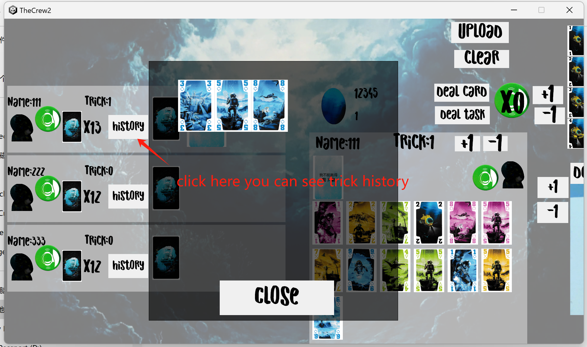

# TheCrew

# Usage Restrictions
This project is for personal and educational purposes only. Commercial use is strictly prohibited.
All copyrighted content used in this project (such as images, music, characters, etc.) belongs to their respective copyright holders. Unauthorized use of such content may infringe on copyright laws.
Please comply with applicable copyright laws and use the content responsibly.
This project is provided "as-is," without any warranties. The author is not liable for any issues or legal disputes that may arise from the use of this project.

# Disclaimer
This project is licensed under the MIT License, but does not apply to copyrighted content used within. Please ensure you comply with the copyright requirements of any third-party content used in this project.
If you enjoy this game, please consider purchasing a physical copy to show your support for the original creators.

# What is this project for
This project is for people who wants to play boardgame TheCrew with their friends online.  
You also have 2 other choices, which are BGA(https://boardgamearena.com/)   
and Tabletop Simulator(https://store.steampowered.com/app/286160/Tabletop_Simulator/)  
But they do have restrictions:   
    Tabletop Simulator is not free.  
    BGA doesn't allow undoing moves, and if you aren't member, you can't play with your friends in same IP address.  
That's why I made this project. To give another way to play TheCrew for free and flexible.  

# How to run the game
(ignore the source file folder, It's not for you.)
1. Run the server program (release/server/main.exe) in your server.  
2. Run the client program (release/client/TheCrew2.exe) and fill the IPAddress and port number. The default port number is 8080. You can change the resolution in the right area.

3. Fill your name and enter room.

# How to play the game
1. **pick campaign**  
You can use +1/-1 button to change to next/last campaign.  
Deal task button is used for those campaigns with specific tasks.  

2. **random seed and diffculty**  
You can deal cards and generate random task cards here.   
Firstly you need to set a seed. Which is used to generate random number for shuffle. Just fill it with any number.  
You can use same seed to play a same game.  
Secondly you need to set a difficulty number, which is provided by campaign in most case.  
Last thing is click DealCard button and DealTask button. You will see some task cards are list at topleft. And you get some game cards.    

3. **an important concept**  
This project isn't in real time connection. So after you changed anything(like deal cards, deal tasks). You need to click UPLOAD button to sync your move to others.  
You will cover others' status so basicly it's recommended that one of you pick campaign, set seeds and difficulty, deal cards and Upload. Then, take turns to act according to the order in the board game.  
**Always remember to Upload after your move** 
4. **how to move a card**  
When you wanna move a card, click it first, you will see a interface, click move button and then you will see yellow box which means this card can be moved to these area, click the yellow box to move.  
**Remember when you finish a move click the UPLOAD button.**

5. **how to gather a trick**  
Click clear button => add trick by 1 => click Upload button.  
It's recommended who win this trick do these things cause these cards will be recorded to his history area.  
**Remember when you finish a move click the UPLOAD button.**  

6. **hint**  
Click the card you want to hint. Click those buttons to hint(untip button used to undo).  
And here is a tool to record whether you have used your hint. Just click it to red after you use it.  
**Remember when you finish a move click the UPLOAD button.**

7. **sign something**  
Some campaigns use limited hint, use this tool to count.  
Sign whether you're captain/you've used your hint.

8. **card tracking tool**  
This tool can assist you know which card is already played. Click card to flip it.
 

# How to have my own server.
I recommended NAT traversal. You can find free one easily.